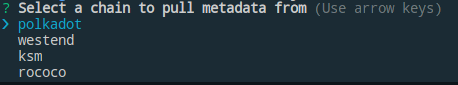

# Polkadot API CLI

## General Usage

```sh
polkadot-api --help
```

```sh
Usage: polkadot-api [options]

Polkadot API CLI

Options:
  -j, --pkgJSONKey <key>  key in package json for descriptor metadata (default: "polkadot-api")
  k --key <key>           first key in descriptor metadata
  f --file <file>         path to descriptor metadata file; alternative to package json
  s --sync                synchronize (default: false)
  -i, --interactive       whether to run in interactive mode (default: false)
  -h, --help              display help for command
```

## Interactive Usage

To run the CLI in interactive mode for the first time.

```sh
polkadot-api --interactive
```

This will bring up a menu where you can select a well known chain to pull metadata
from. This will download the metadata using smoldot, which will take some time.



You will have the option to specify a `key`. The key can be anything you
want but it represents the name your descriptors will be saved under. For example
you can have one key called `polkadot` and another key called `kusama.` Then you
will be asked to choose a name to save the metadata under. The next time you ru
the CLI it will pull the metadata from this file, rather than from on-chain.

The metadata will be saved in scale format.

Then you will be asked whether you want to save it to a file or in your
`package.json` under the key `polkadot-api`. By default the CLI will look
for your descriptors in the `package.json` file, otherwise you can supply the
file with the `--file` flag.

The the last thing you will be asked is what directory to output the codegen in.

An example saved descriptors file will look something like this.

```json
{
  "polkadot": {
    "metadata": "test/artifacts/polkadot-metadata.scale",
    "outputFolder": "out"
  }
}
```

To use the codegen, refer to the [client.ts example](../../experiments/src/client.ts).

## Non-Interactive Usage

The most basic usage to run in non-interactive mode is to just pass the `--key` flag.

```sh
polkadot-api --key polkadot
```

This will run the codegen using the metadata file under the `metadata` key
and it will be outputted in specified `outputFolder`. By default it will
look for your descriptors in your `package.json` file under the key
`polkadot-api`. To override the key in the package.json use the `--pkgJSONKey` flag.

```sh
polkadot-api --key polkadot --pkgJSONKey papi
```

If you are using a file then just specify the `--file` flag.

```sh
polkadot-api --key polkadot --file polkadot-descriptors.json
```
