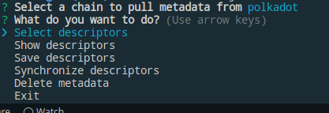
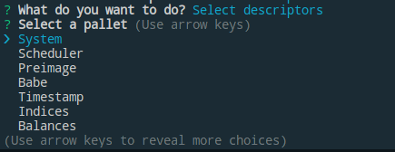
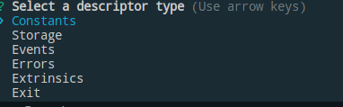
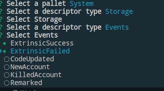
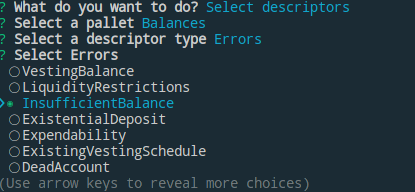
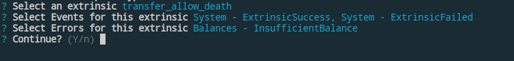
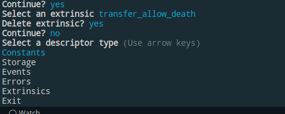
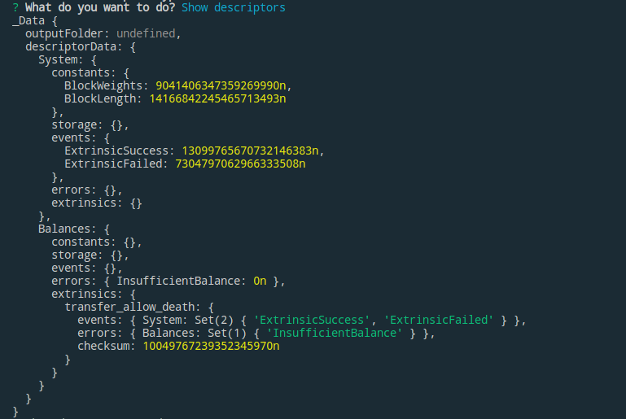
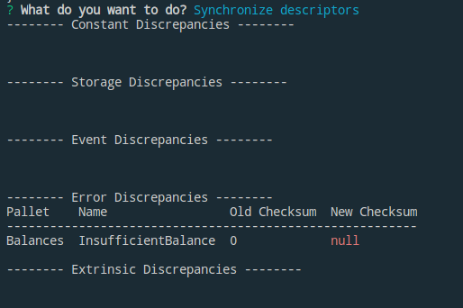
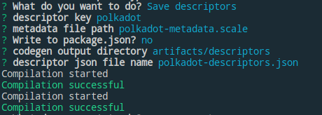

# Polkadot API CLI

## General Usage

```sh
polkadot-api --help
```

```sh
Usage: polkadot-api [options]

Polkadot API CLI

Options:
  -j, --pkgJSONKey <key>  key in package json for descriptor metadata (default: "polkadot-api")
  k --key <key>           first key in descriptor metadata
  f --file <file>         path to descriptor metadata file; alternative to package json
  s --sync                synchronize (default: false)
  -i, --interactive       whether to run in interactive mode (default: false)
  -h, --help              display help for command
```

## Interactive Usage

To run the CLI in interactive mode for the first time.

```sh
polkadot-api --interactive
```

This will bring up a menu where you can select a well known chain to pull metadata
from. This will download the metadata using smoldot, which will take some time.


From here, you are presented a menu of options



The first option is `Select Descriptors` from which you can choose from a list of
pallets and for each pallet you can select `Constants`, `Storage`, `Events`,
`Errors`, and `Extrinsics`





When selecting an extrinsic, ensure you have selected all the associated events
and errors that you care about for that extrinsic. For example, you may want
to select `ExtrinsicSuccess` and `ExtrinsicFailed` events from the System pallet
and `InsufficientBalance` error from the Balances pallet before selecting a
`transfer_allow_death` extrinsic.







The `Continue` prompt is for whether you want to select another extrinsic from
the same pallet or to exit and return to the main menu.

If you select the same extrinsic again, you can choose to delete it.



Once you've selected your descriptors you can select `Show Descriptors` to see
a preview out the output.



In here, for each item you selected it maps to a checksum. If the metadata ever
changes and one of the items you selected has changed in the metadata, the
checksum will also change. This is critical because it allows you
to understand what parts of your code are affected by runtime upgrades.

To visualize this, select `Delete metadata`. This will delete a random constant,
storage, event, error, and extrinsic in each pallet.

Then if you select `Synchronize descriptors`, it will display to you the difference
and you can choose to accept the changes or not.



Finally, we can choose to `Save Descriptors`. When saving it will give you
an option to specify a `key`. The key can be anything you want but it represents
the name your descriptors will be saved under. For example you can have one
key called `polkadot` and another key called `kusama.` Then you will be asked
to choose a name to save the metadata under. This will include any edits you
made with `Delete metadata`. The next time you run the CLI it will pull the
metadata from this file, rather than from on-chain.

The metadata will be saved in scale format.

Then you will be asked whether you want to save it to a file or in your
`package.json` under the key `polkadot-api`. By default the CLI will look
for your descriptors in the `package.json` file, otherwise you can supply the
file with the `--file` flag.

The the last thing you will be asked is what direct to output the codegen in.



The saved descriptors file will look something like this.

```json
{
  "polkadot": {
    "metadata": "polkadot-metadata.scale",
    "outputFolder": "artifacts/descriptors",
    "descriptors": {
      "System": {
        "constants": {},
        "storage": {},
        "events": {
          "ExtrinsicSuccess": "13099765670732146383",
          "ExtrinsicFailed": "7304797062966333508"
        },
        "errors": {},
        "extrinsics": {}
      },
      "Balances": {
        "constants": {},
        "storage": {},
        "events": {},
        "errors": {
          "InsufficientBalance": "0"
        },
        "extrinsics": {
          "transfer_allow_death": {
            "events": {
              "System": ["ExtrinsicSuccess", "ExtrinsicFailed"]
            },
            "errors": {
              "Balances": ["InsufficientBalance"]
            },
            "checksum": "10049767239352345970"
          }
        }
      }
    }
  }
}
```

To use the codegen, refer to the [client.ts example](../../experiments/src/client.ts).

## Non-Interactive Usage

The most basic usage to run in non-interactive mode is to just pass the `--key` flag.

```sh
polkadot-api --key polkadot
```

This will run the codegen using the metadata file under the `metadata` key
and it will be outputted in specified `outputFolder`. By default it will
look for your descriptors in your `package.json` file under the key
`polkadot-api`. To override the key in the package.json use the `--pkgJSONKey` flag.

```sh
polkadot-api --key polkadot --pkgJSONKey papi
```

If you are using a file then just specify the `--file` flag.

```sh
polkadot-api --key polkadot --file polkadot-descriptors.json
```

Lastly it you want to automatically detect runtime upgrades in the metadata and
overwrite the descriptors using the updated metadata using the `--sync` flag.

```sh
polkadot-api --key polkadot --file polkadot-descriptors.json --sync
```
